# RClub_Assignment03
Xiaoyan Yue  
4/24/2017  


#Load the packages

```r
library(tidyverse)
```

```
## Loading tidyverse: ggplot2
## Loading tidyverse: tibble
## Loading tidyverse: tidyr
## Loading tidyverse: readr
## Loading tidyverse: purrr
## Loading tidyverse: dplyr
```

```
## Conflicts with tidy packages ----------------------------------------------
```

```
## filter(): dplyr, stats
## lag():    dplyr, stats
```

```r
library(ggplot2)
theme_set(theme_grey(12))
```

  
#Practise on mpg

```r
mpg
```

```
## # A tibble: 234 × 11
##    manufacturer      model displ  year   cyl      trans   drv   cty   hwy
##           <chr>      <chr> <dbl> <int> <int>      <chr> <chr> <int> <int>
## 1          audi         a4   1.8  1999     4   auto(l5)     f    18    29
## 2          audi         a4   1.8  1999     4 manual(m5)     f    21    29
## 3          audi         a4   2.0  2008     4 manual(m6)     f    20    31
## 4          audi         a4   2.0  2008     4   auto(av)     f    21    30
## 5          audi         a4   2.8  1999     6   auto(l5)     f    16    26
## 6          audi         a4   2.8  1999     6 manual(m5)     f    18    26
## 7          audi         a4   3.1  2008     6   auto(av)     f    18    27
## 8          audi a4 quattro   1.8  1999     4 manual(m5)     4    18    26
## 9          audi a4 quattro   1.8  1999     4   auto(l5)     4    16    25
## 10         audi a4 quattro   2.0  2008     4 manual(m6)     4    20    28
## # ... with 224 more rows, and 2 more variables: fl <chr>, class <chr>
```

```r
ggplot(data = mpg) + 
  geom_point(mapping = aes(x = displ, y = hwy))
```

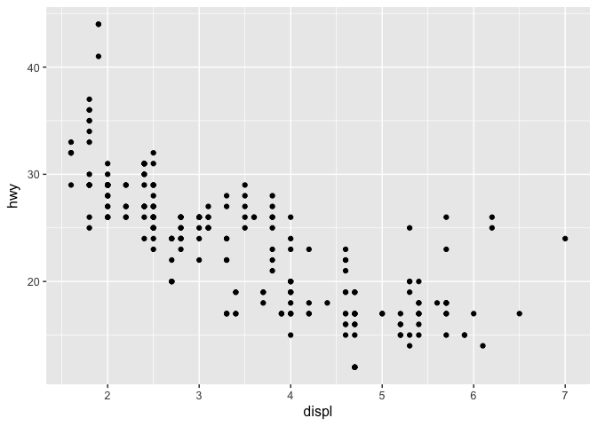<!-- -->

  
#Practise 3.2.4
  
##Run ggplot(data = mpg) what do you see?

```r
ggplot(data = mpg)#nothing
```

<!-- -->
  
##How many rows are in mtcars? How many columns?

```r
dim(mtcars)
```

```
## [1] 32 11
```

  
##What does the drv variable describe? Read the help for ?mpg to find out.

```r
?mpg
#f = front-wheel drive, r = rear wheel drive, 4 = 4wd
```

  
##Make a scatterplot of hwy vs cyl.

```r
ggplot(data = mpg) + geom_point(mapping = aes(x = hwy, y = cyl))
```

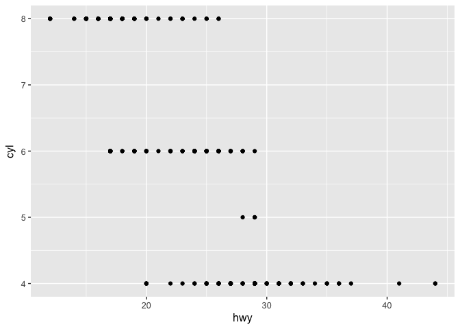<!-- -->
  
##What happens if you make a scatterplot of class vs drv. Why is the plot not useful?

```r
ggplot(data = mpg) + geom_point(mapping = aes(x = class, y = drv))#it's not visualized, no meaningful
```

<!-- -->

  
#practise for Aesthetic mapping
  
##by color

```r
ggplot(data = mpg) + 
  geom_point(mapping = aes(x = displ, y = hwy, color = class))
```

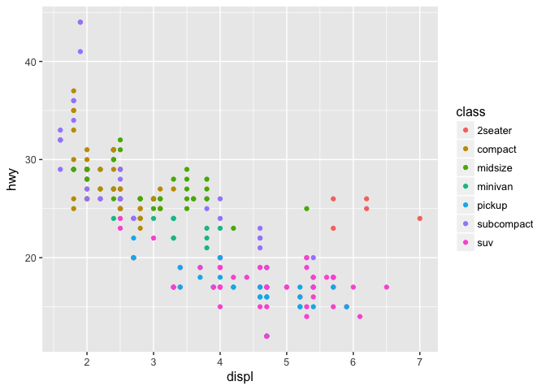<!-- -->
  
##by size

```r
ggplot(data = mpg) + 
  geom_point(mapping = aes(x = displ, y = hwy, size = class))
```

```
## Warning: Using size for a discrete variable is not advised.
```

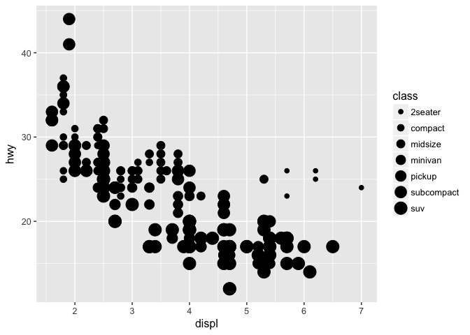<!-- -->
  
##by alpha aesthetic

```r
ggplot(data = mpg) + 
  geom_point(mapping = aes(x = displ, y = hwy, alpha = class))
```

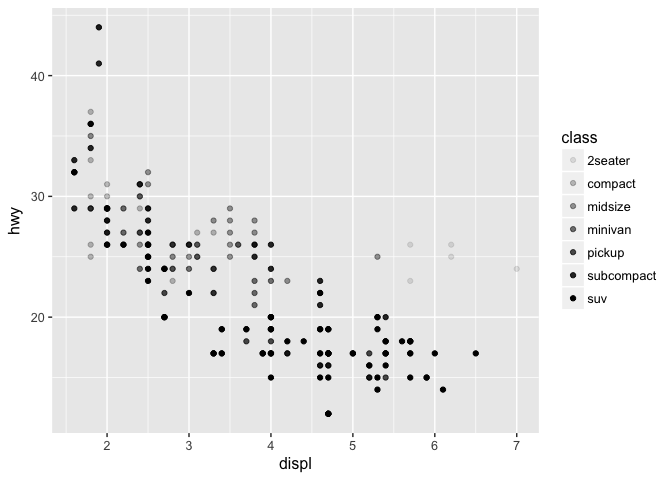<!-- -->
  
##by shape aesthetic

```r
ggplot(data = mpg) + 
  geom_point(mapping = aes(x = displ, y = hwy, shape = class))
```

```
## Warning: The shape palette can deal with a maximum of 6 discrete values
## because more than 6 becomes difficult to discriminate; you have 7.
## Consider specifying shapes manually if you must have them.
```

```
## Warning: Removed 62 rows containing missing values (geom_point).
```

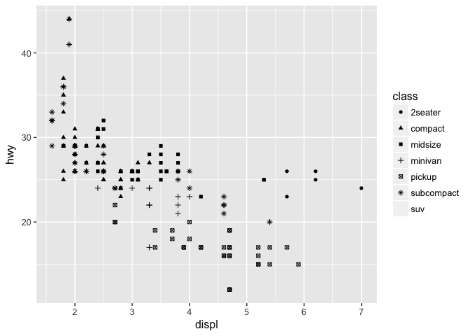<!-- -->
  
##change the color for the basic aesthetic

```r
ggplot(data = mpg) + 
  geom_point(mapping = aes(x = displ, y = hwy), color = "blue")
```

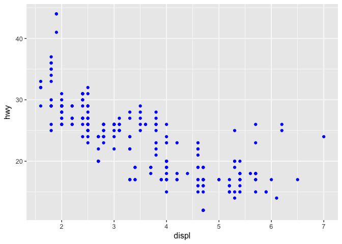<!-- -->

  
#practise in 3.3.1
  
##What’s gone wrong with this code? Why are the points not blue?

```r
ggplot(data = mpg) + 
  geom_point(mapping = aes(x = displ, y = hwy, color = "blue"))
```

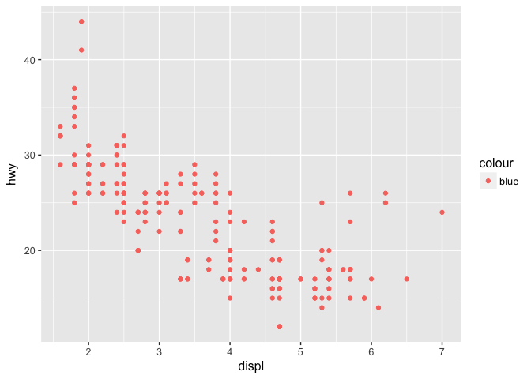<!-- -->

```r
#the color need to go outside of aes(), if I want to change the color of the point
```
  
##Which variables in mpg are categorical? Which variables are continuous? (Hint: type ?mpg to read the documentation for the dataset). How can you see this information when you run mpg?

```r
?mpg
mpg
```

```
## # A tibble: 234 × 11
##    manufacturer      model displ  year   cyl      trans   drv   cty   hwy
##           <chr>      <chr> <dbl> <int> <int>      <chr> <chr> <int> <int>
## 1          audi         a4   1.8  1999     4   auto(l5)     f    18    29
## 2          audi         a4   1.8  1999     4 manual(m5)     f    21    29
## 3          audi         a4   2.0  2008     4 manual(m6)     f    20    31
## 4          audi         a4   2.0  2008     4   auto(av)     f    21    30
## 5          audi         a4   2.8  1999     6   auto(l5)     f    16    26
## 6          audi         a4   2.8  1999     6 manual(m5)     f    18    26
## 7          audi         a4   3.1  2008     6   auto(av)     f    18    27
## 8          audi a4 quattro   1.8  1999     4 manual(m5)     4    18    26
## 9          audi a4 quattro   1.8  1999     4   auto(l5)     4    16    25
## 10         audi a4 quattro   2.0  2008     4 manual(m6)     4    20    28
## # ... with 224 more rows, and 2 more variables: fl <chr>, class <chr>
```

```r
##"manufacturer","model","trans","drv", "fl", and "class" are categorials
##"displ","year","cyl", "cty", and "hwy" are continuous

##let test by plot
hist(mpg$displ)
```

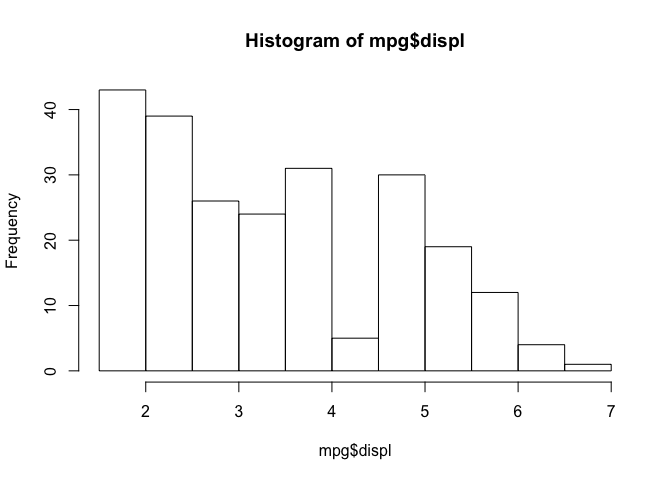<!-- -->

```r
hist(mpg$year)
```

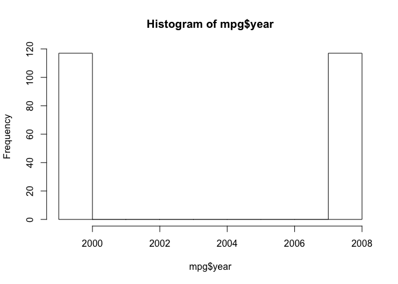<!-- -->

```r
hist(mpg$cyl)
```

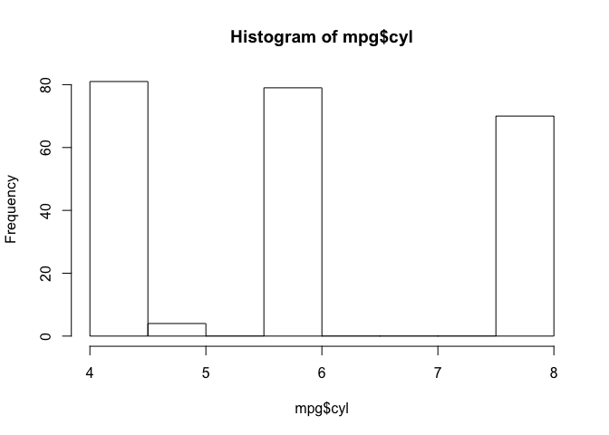<!-- -->

```r
hist(mpg$cty)#normal distribution
```

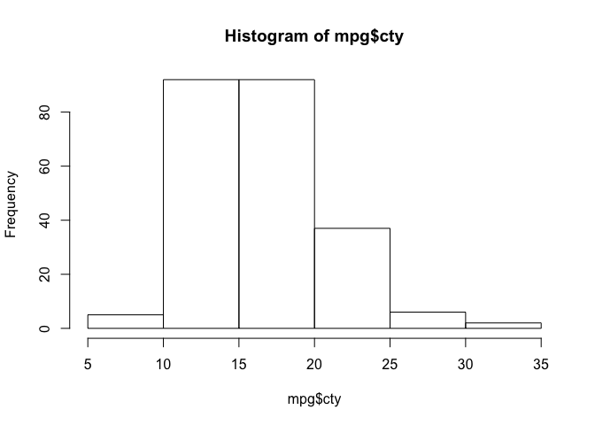<!-- -->

```r
hist(mpg$hwy)#normal distribution
```

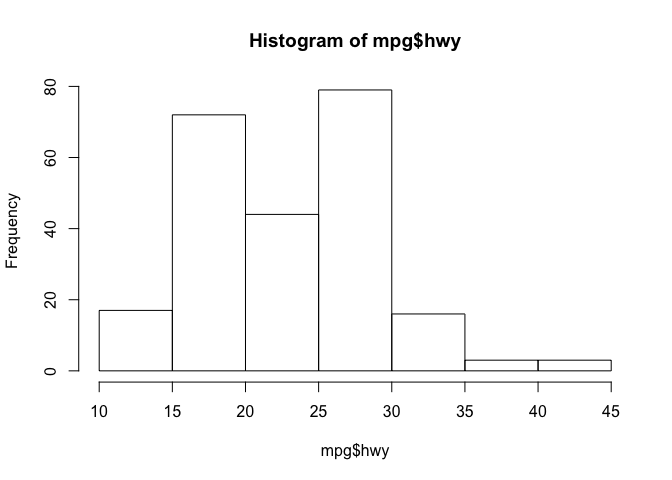<!-- -->
  
##Map a continuous variable to color, size, and shape. How do these aesthetics behave differently for categorical vs. continuous variables?
  
###color

```r
mpg
```

```
## # A tibble: 234 × 11
##    manufacturer      model displ  year   cyl      trans   drv   cty   hwy
##           <chr>      <chr> <dbl> <int> <int>      <chr> <chr> <int> <int>
## 1          audi         a4   1.8  1999     4   auto(l5)     f    18    29
## 2          audi         a4   1.8  1999     4 manual(m5)     f    21    29
## 3          audi         a4   2.0  2008     4 manual(m6)     f    20    31
## 4          audi         a4   2.0  2008     4   auto(av)     f    21    30
## 5          audi         a4   2.8  1999     6   auto(l5)     f    16    26
## 6          audi         a4   2.8  1999     6 manual(m5)     f    18    26
## 7          audi         a4   3.1  2008     6   auto(av)     f    18    27
## 8          audi a4 quattro   1.8  1999     4 manual(m5)     4    18    26
## 9          audi a4 quattro   1.8  1999     4   auto(l5)     4    16    25
## 10         audi a4 quattro   2.0  2008     4 manual(m6)     4    20    28
## # ... with 224 more rows, and 2 more variables: fl <chr>, class <chr>
```

```r
ggplot(data = mpg) + 
  geom_point(mapping = aes(x = displ, y = hwy, color = cty))
```

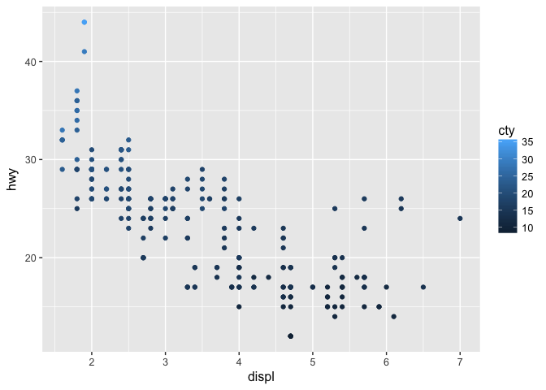<!-- -->

```r
#the colors are also continuous, so it is hard to tell the difference between different continuous variables
```
  
###size

```r
ggplot(data = mpg) + 
  geom_point(mapping = aes(x = displ, y = hwy, size = cty))
```

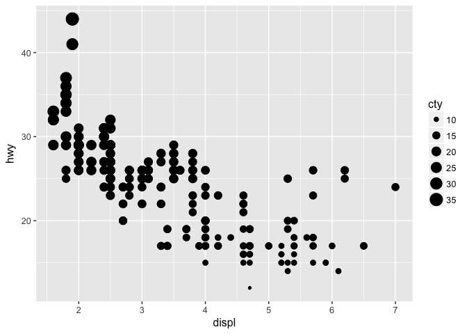<!-- -->
  
###shape

```r
#mpg
#ggplot(data = mpg) + 
  #geom_point(mapping = aes(x = displ, y = hwy, shape = class))
#A continuous variable can not be mapped to shape
```
  
##What happens if you map the same variable to multiple aesthetics?

```r
ggplot(data = mpg) + 
  geom_point(mapping = aes(x = displ, y = displ, color = displ))
```

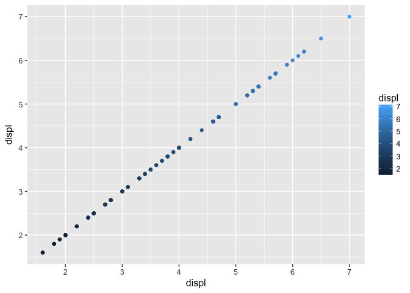<!-- -->

```r
#it will become a great correlation line 
```
  
##What does the stroke aesthetic do? What shapes does it work with? (Hint: use ?geom_point)

```r
ggplot(data = mpg) + 
  geom_point(mapping = aes(x = displ, y = hwy,color = model), stroke = 1)
```

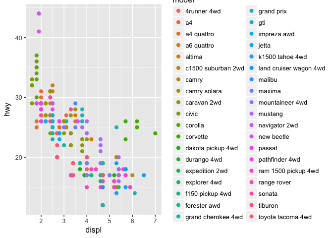<!-- -->

```r
?geom_point
#it can be used to change the size of the points in the plot
```
  
##What happens if you map an aesthetic to something other than a variable name, like aes(colour = displ < 5)?

```r
ggplot(data = mpg) + 
  geom_point(mapping = aes(x = displ, y = hwy,color = displ < 5), stroke = 1)
```

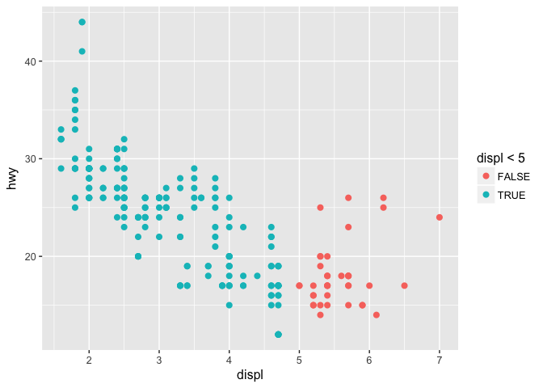<!-- -->

  
#practise on 'Facets' part. One way to add additional variables is with aesthetics, particularly useful for categorical variables.
  
##facet_wrap, to facet your plot by a single variable. The variable that you pass to facet_wrap() should be discrete.

```r
ggplot(data = mpg) + 
  geom_point(mapping = aes(x = displ, y = hwy)) + 
  facet_wrap(~ class, nrow = 2)
```

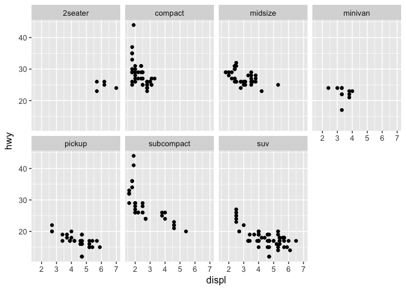<!-- -->

  
##facet_grid, to facet your plot on the combination of two variables, or one variable

```r
ggplot(data = mpg) + 
  geom_point(mapping = aes(x = displ, y = hwy)) + 
  facet_grid(drv ~ cyl)
```

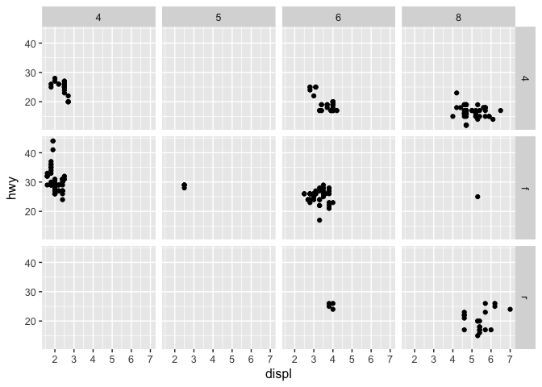<!-- -->

```r
ggplot(data = mpg) + 
  geom_point(mapping = aes(x = displ, y = hwy)) + 
  facet_grid(.~ cyl)
```

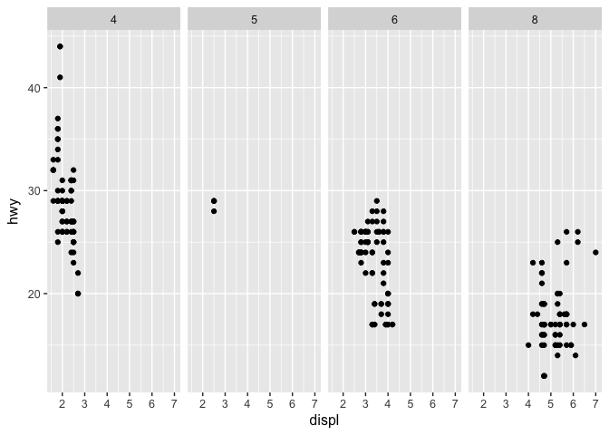<!-- -->
  
#3.5.1 Excercises
  
##1.What happens if you facet on a continuous variable?
  
###facet_wrap

```r
ggplot(data = mpg) + 
  geom_point(mapping = aes(x = displ, y = hwy)) + 
  facet_wrap(~ cty, nrow = 2)
```

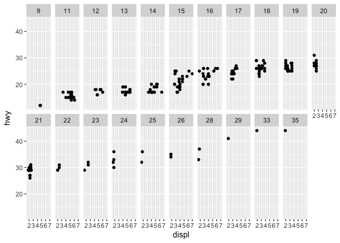<!-- -->
  
###try to facet_grid the continuous variable

```r
ggplot(data = mpg) + 
  geom_point(mapping = aes(x = displ, y = hwy)) + 
  facet_grid(~ cty)
```

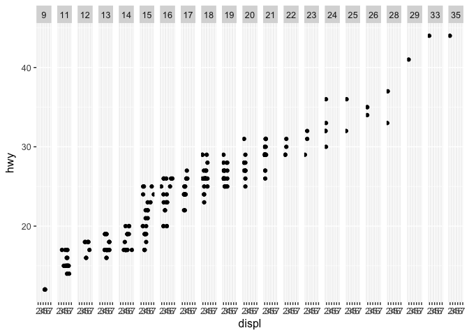<!-- -->
  
##2.What do the empty cells in plot with facet_grid(drv ~ cyl) mean? How do they relate to this plot?

```r
ggplot(data = mpg) + 
  geom_point(mapping = aes(x = drv, y = cyl))
```

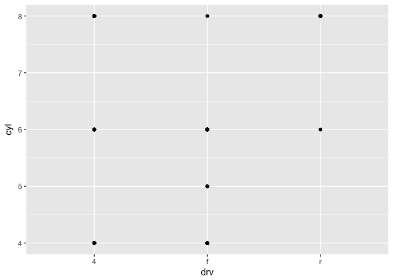<!-- -->

```r
#there are no points when drv equals to "4" and cyl equals to "5"
```
  
##3.What plots does the following code make? What does . do?
  
###facet only in y-axies

```r
ggplot(data = mpg) + 
  geom_point(mapping = aes(x = displ, y = hwy)) +
  facet_grid(drv ~ .)
```

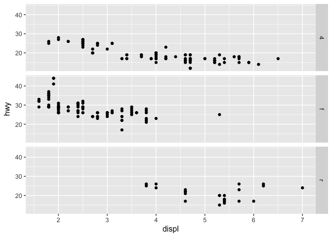<!-- -->

```r
?facet_grid
```
  
###facet only in x-axies

```r
ggplot(data = mpg) + 
  geom_point(mapping = aes(x = displ, y = hwy)) +
  facet_grid(. ~ cyl)
```

<!-- -->
  
##4.Take the first faceted plot in this section:

```r
ggplot(data = mpg) + 
  geom_point(mapping = aes(x = displ, y = hwy, color=class)) + 
  facet_wrap(~ class, nrow = 2)
```

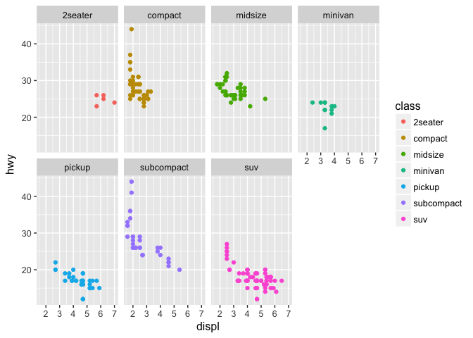<!-- -->

```r
#it gives us more information for a specified model
```
  
###What are the advantages to using faceting instead of the colour aesthetic? 

```r
ggplot(data = mpg) + 
  geom_point(mapping = aes(x = displ, y = hwy, color = class))
```

<!-- -->

  
###What are the disadvantages?
  
####There is less data in each figure, we can't see a strong negative relationship between displ and hwy as it was displayed in the color aesthetic figure.

  
###How might the balance change if you had a larger dataset?
  
####Each figure may have a strong negative relationships between displ and hwy.

  
##5.Read ?facet_wrap. What does nrow do? What does ncol do?

```r
?facet_wrap

#nrow and ncol represented the number of rows and columns will be created when you facet_warp your original plot.
```

  
###What other options control the layout of the individual panels? 
  
#####Try scales, which can allow scales to vary across the panels

```r
ggplot(mpg, aes(displ, hwy)) +
  geom_point() +
  facet_wrap(~c("cyl", "drv"), scales = "free")
```

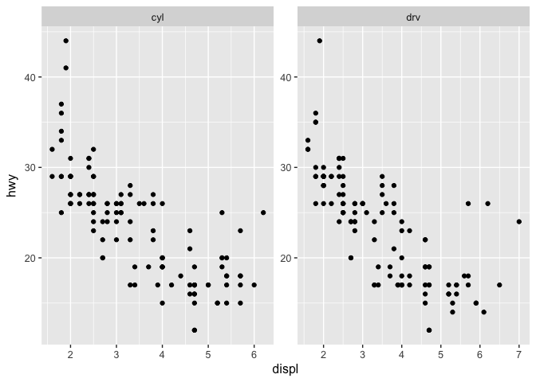<!-- -->
  
####Try labeller, which control how labels are printed in panels

```r
ggplot(mpg, aes(displ, hwy)) +
  geom_point() +
  facet_wrap(c("cyl", "drv"), labeller = "label_both")
```

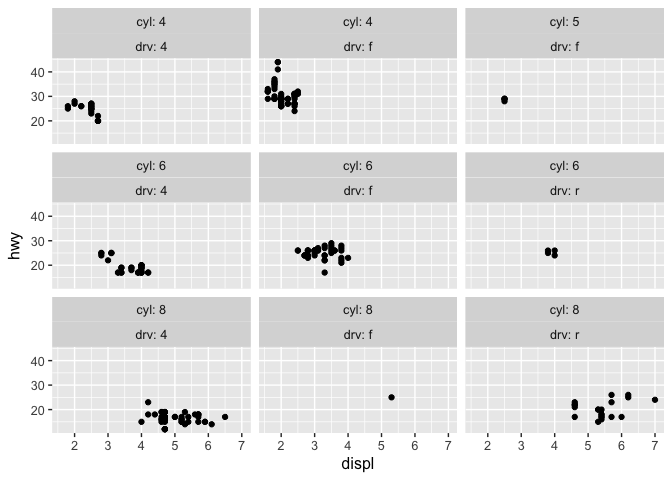<!-- -->
  
####Try as.table, if can change the position of the panel according to the values. If TRUE, the default, the facets are laid out like a table with highest values at the bottom-right. If FALSE, the facets are laid out like a plot with the highest value at the top-right.

```r
ggplot(mpg, aes(displ, hwy)) +
  geom_point() +
  facet_wrap(c("cyl", "drv"), as.table = FALSE)
```

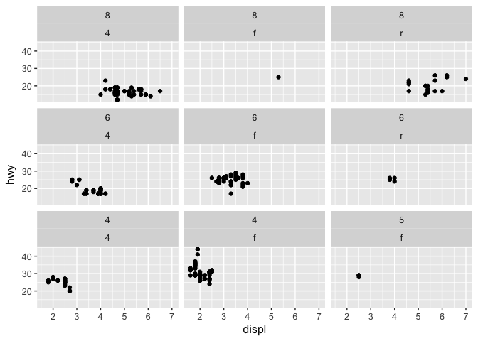<!-- -->
  
####Try switch. Change the position of the labels. If "x", the top labels will be displayed to the bottom. If "y", the right-hand side labels will be displayed to the left. Can also be set to "both".

```r
ggplot(mpg, aes(displ, hwy)) +
  geom_point() +
  facet_wrap(c("cyl", "drv"), switch = "y")
```

```
## Warning: 'switch' is deprecated.
## Use 'strip.position' instead.
## See help("Deprecated")
```

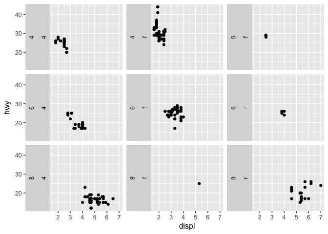<!-- -->
  
####Try drop ?

```r
ggplot(mpg, aes(displ, hwy)) +
  geom_point() +
  facet_wrap(c("cyl", "drv"), drop = FALSE)
```

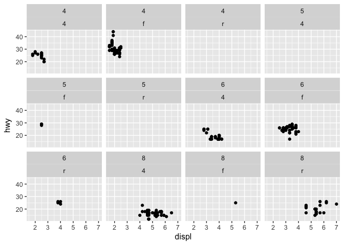<!-- -->
  
####Try strip.position, can place the labels on either of the four sides

```r
ggplot(mpg, aes(displ, hwy)) +
  geom_point() +
  facet_wrap(c("cyl", "drv"), strip.position ="right")
```

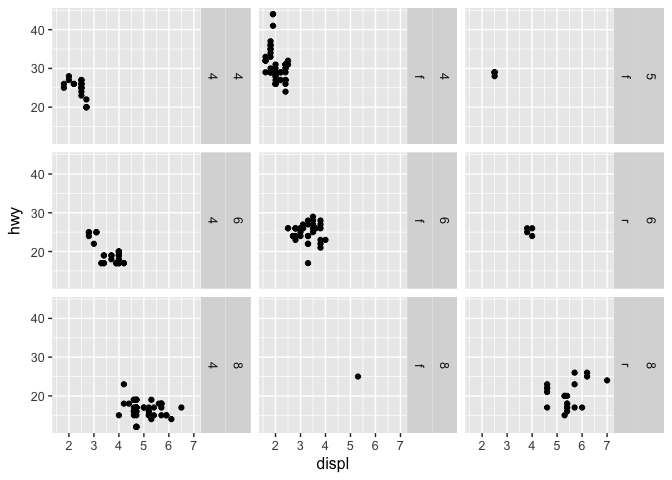<!-- -->
  
####Try shrink

```r
par(mfrow=c(1,2))
ggplot(mpg, aes(displ, hwy)) +
  geom_point() +
  facet_wrap(c("cyl", "drv"), shrink =TRUE)
```

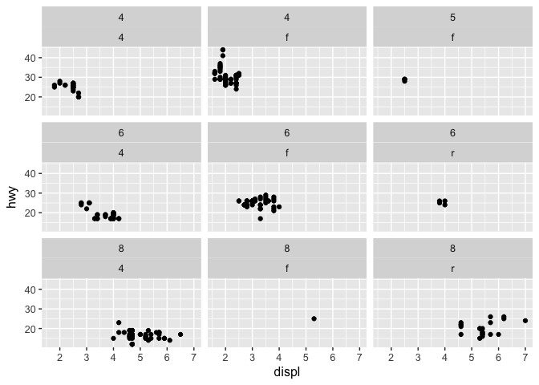<!-- -->

```r
ggplot(mpg, aes(displ, hwy)) +
  geom_point() +
  facet_wrap(c("cyl", "drv"), shrink =FALSE)
```

<!-- -->

```r
##There's no difference???
```

  
###Why doesn’t facet_grid() have nrow and ncol variables?

```r
?facet_grid

##it was faceted according to the levels of variables. The number of rows or columns were determined by the levels of the variable.
```

