# Chapter03-2
Xiaoyan Yue  
4/30/2017  


```r
knitr::opts_chunk$set(echo = TRUE, cache= TRUE, autodep = TRUE)
library(tidyverse)
```

```
## Loading tidyverse: ggplot2
## Loading tidyverse: tibble
## Loading tidyverse: tidyr
## Loading tidyverse: readr
## Loading tidyverse: purrr
## Loading tidyverse: dplyr
```

```
## Conflicts with tidy packages ----------------------------------------------
```

```
## filter(): dplyr, stats
## lag():    dplyr, stats
```

```r
library(gridExtra)
```

```
## 
## Attaching package: 'gridExtra'
```

```
## The following object is masked from 'package:dplyr':
## 
##     combine
```

  
#Run the code in the Book 
#3.6  Geometric objects
##geom_smooth

```r
#par(mfcol=c(1:2))
plot1 <- ggplot(data = mpg) + 
  geom_point(mapping = aes(x = displ, y = hwy))

plot2 <- ggplot(data = mpg) + 
  geom_smooth(mapping = aes(x = displ, y = hwy))

grid.arrange(plot1, plot2, nrow=1, ncol=2)
```

```
## `geom_smooth()` using method = 'loess'
```

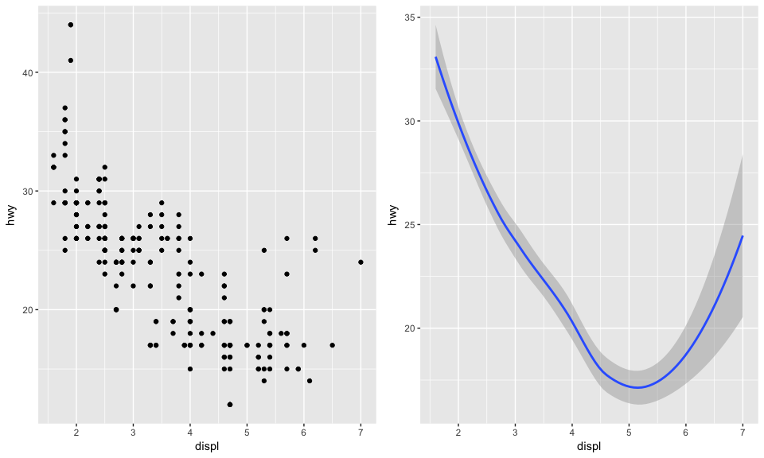<!-- -->
 
##More aesthetic for geom_smooth

```r
ggplot(data = mpg) + 
  geom_smooth(mapping = aes(x = displ, y = hwy, linetype = drv))#linetype
```

```
## `geom_smooth()` using method = 'loess'
```

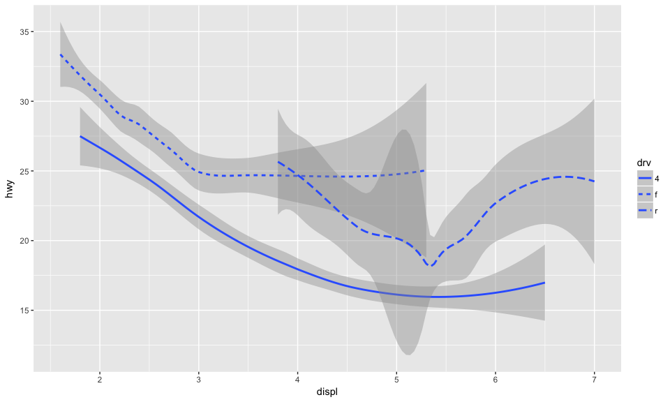<!-- -->
 
##Overlaying the lines on top of the raw data and then coloring everything according to drv

```r
ggplot(data = mpg) + 
  geom_point(mapping = aes(x = displ, y = hwy, color = drv)) + 
  geom_smooth(mapping = aes(x = displ, y = hwy, linetype = drv, color = drv))
```

```
## `geom_smooth()` using method = 'loess'
```

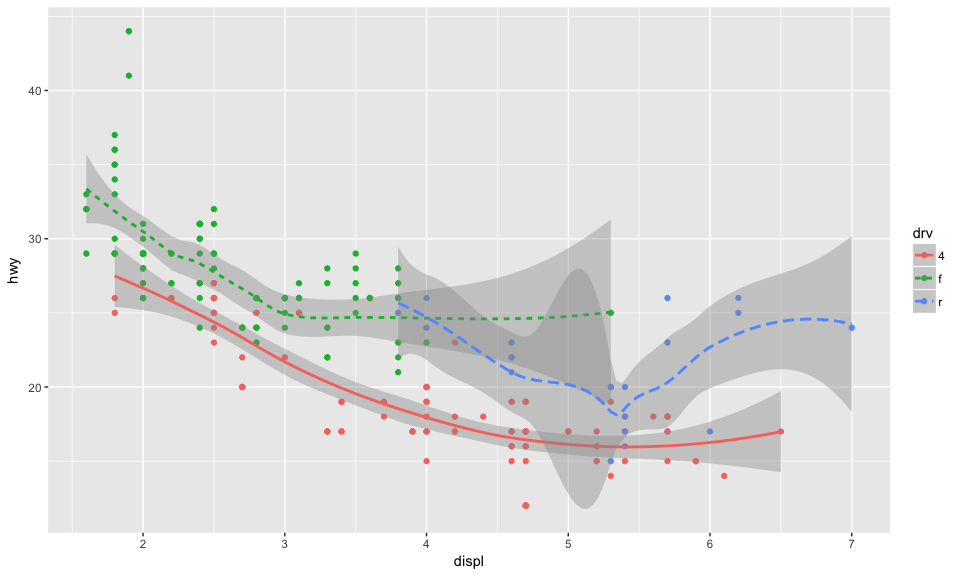<!-- -->
 
##Group

```r
ggplot(data = mpg) +
  geom_smooth(mapping = aes(x = displ, y = hwy, group = drv))#No legend as linestyle
```

```
## `geom_smooth()` using method = 'loess'
```

<!-- -->
  
##Display mutiple genoms in the same plot, 2 ways

```r
ggplot(data = mpg) + 
  geom_point(mapping = aes(x = displ, y = hwy)) +
  geom_smooth(mapping = aes(x = displ, y = hwy))#introduces some duplication
```

```
## `geom_smooth()` using method = 'loess'
```

<!-- -->

```r
ggplot(data = mpg, mapping = aes(x = displ, y = hwy)) + 
  geom_point() + 
  geom_smooth()
```

```
## `geom_smooth()` using method = 'loess'
```

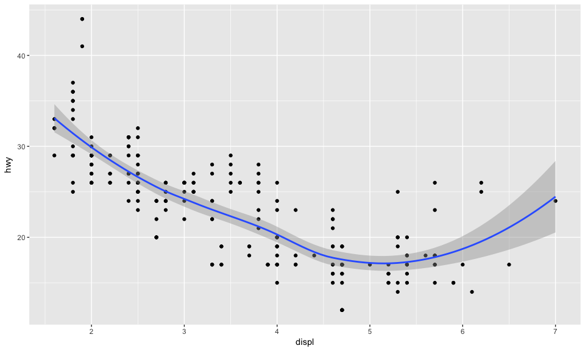<!-- -->
  
##Display different aesthetics in different layers

```r
ggplot(data = mpg, mapping = aes(x=displ, y=hwy)) +
  geom_smooth() +
  geom_point(mapping = aes(color=class))
```

```
## `geom_smooth()` using method = 'loess'
```

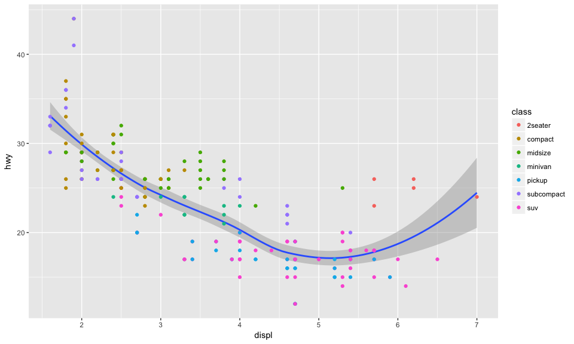<!-- -->

##Try filter in plotting

```r
ggplot(data = mpg, mapping = aes(x = displ, y = hwy)) + 
  geom_point(mapping = aes(color = class)) + 
  geom_smooth(data = filter(mpg, class == "subcompact"), se = FALSE)
```

```
## `geom_smooth()` using method = 'loess'
```

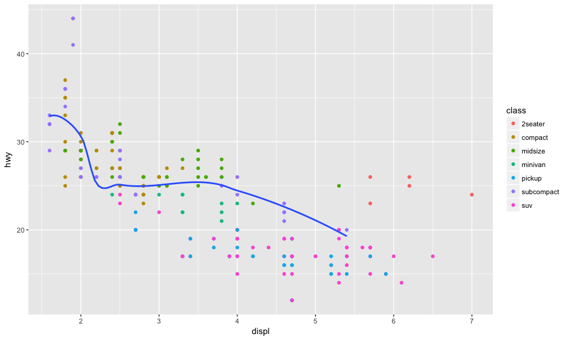<!-- -->
  
#3.7 Statistical transformations
## New dataset for bar charts

```r
ggplot(data = diamonds) + 
  geom_bar(mapping = aes(x = cut))
```

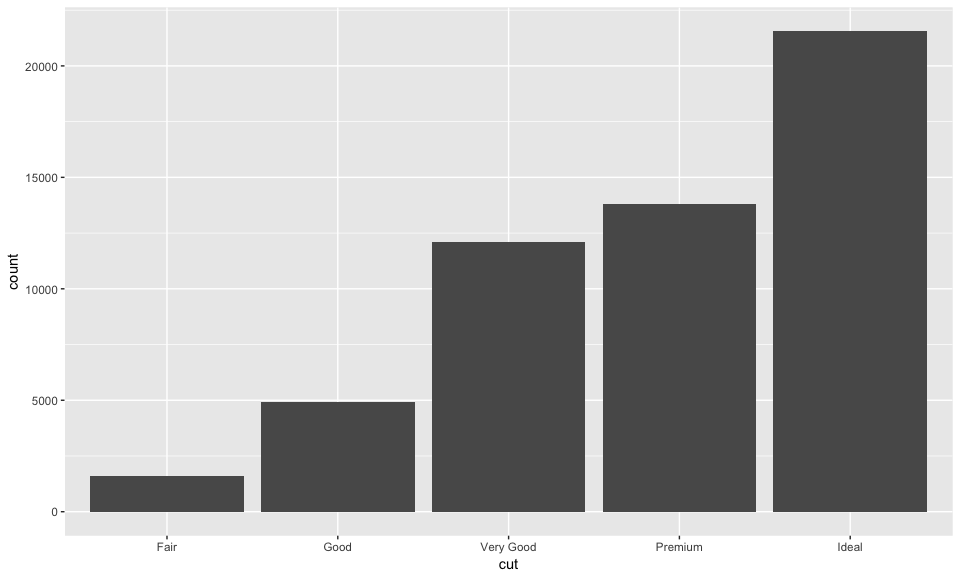<!-- -->

```r
#Many graphs, like scatterplots, plot the raw values of your dataset. Other graphs, like bar charts, calculate new values to plot
```
  
##stat_count

```r
ggplot(data = diamonds) + 
  stat_count(mapping = aes(x = cut))
```

<!-- -->

```r
#This works because every geom has a default stat; and every stat has a default geom.
```
  
##Try to change the default stat in geom_bar

```r
demo <- tribble(
  ~a,      ~b,
  "bar_1", 20,
  "bar_2", 30,
  "bar_3", 40
)

ggplot(data = demo) +
  geom_bar(mapping = aes(x = a, y = b), stat = "identity")
```

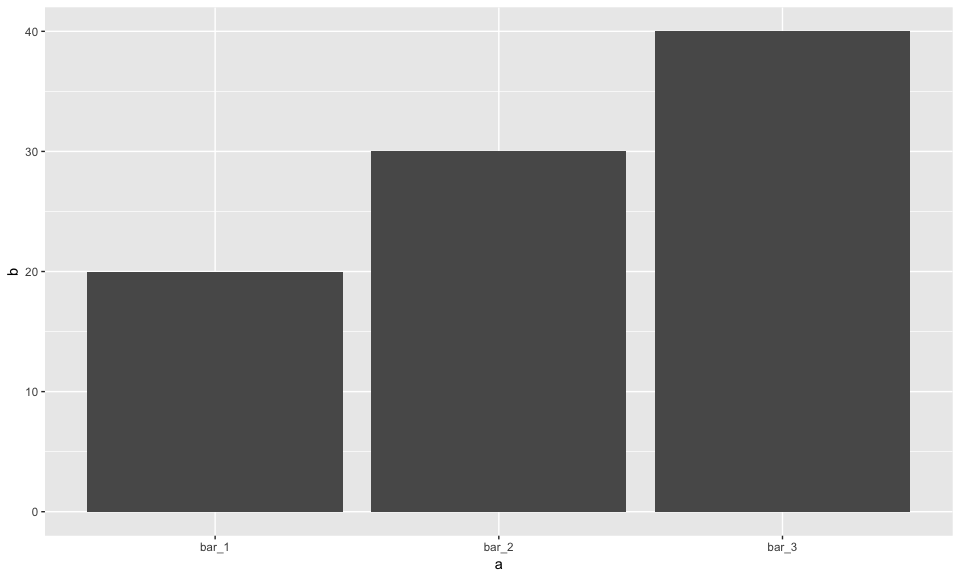<!-- -->

```r
#This lets us map the height of the bars to the raw values of a y variable
```
  
##Try to change the default count to probability

```r
ggplot(data = diamonds) + 
  geom_bar(mapping = aes(x = cut, y = ..prop.., group = 1))
```

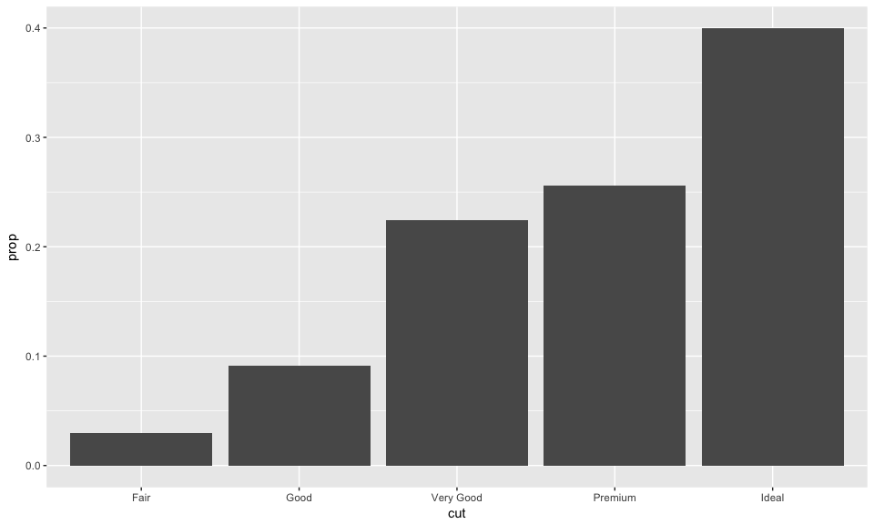<!-- -->
  
##Try to draw greater attention for statistical transformation

```r
ggplot(data = diamonds) + 
  stat_summary(
    mapping = aes(x = cut, y = depth),
    fun.ymin = min,
    fun.ymax = max,
    fun.y = median
  )
```

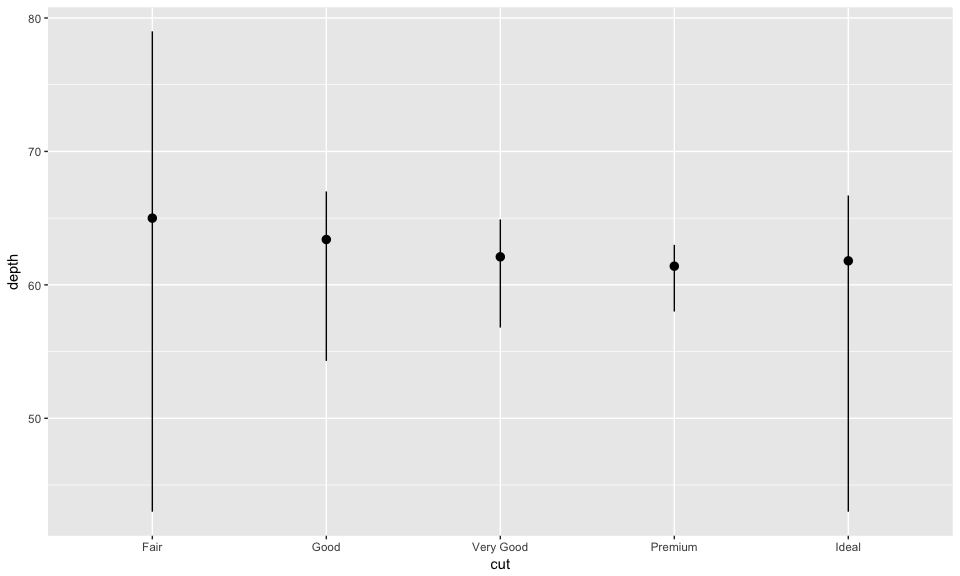<!-- -->

```r
#ggplot2 provides over 20 stats for you to use. Each stat is a function
#?stat_bin
```
  
#3.8 Position adjustment

```r
pl1 <- ggplot(data = diamonds) + 
  geom_bar(mapping = aes(x = cut, colour = cut))
pl2 <- ggplot(data = diamonds) + 
  geom_bar(mapping = aes(x = cut, fill = cut))
grid.arrange(pl1,pl2,nrow=1,ncol=2)
```

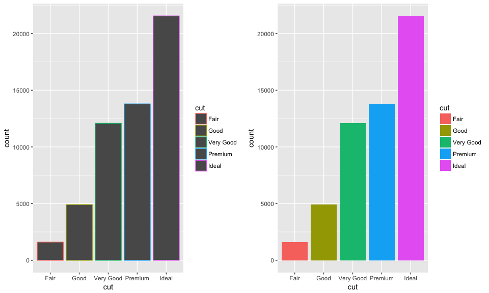<!-- -->
  
  
##Try to map the fill aesthetic to another variable and do the 'position' adjustment in last plotting

```r
ql1 <- ggplot(data = diamonds) + 
  geom_bar(mapping = aes(x = cut, fill = clarity))

ql2 <- ggplot(data = diamonds) + 
  geom_bar(mapping = aes(x = cut, fill = clarity), position = "identity")

grid.arrange(ql1,ql2,nrow=1,ncol=2)
```

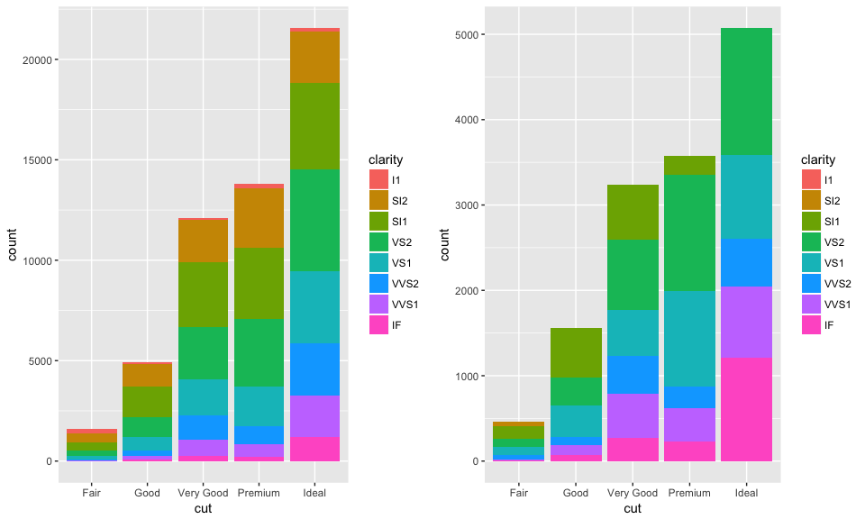<!-- -->

```r
#position = "identity" will place each object exactly where it falls in the context of the graph. This is not very useful for bars, because it overlaps them.
```
  
##Look at the overlapping and fill=NA

```r
ll1 <- ggplot(data = diamonds, mapping = aes(x = cut, fill = clarity)) + 
  geom_bar(alpha = 1/5, position = "identity")
ll2 <- ggplot(data = diamonds, mapping = aes(x = cut, colour = clarity)) + 
  geom_bar(fill = NA, position = "identity")

grid.arrange(ll1,ll2,nrow=1,ncol=2)
```

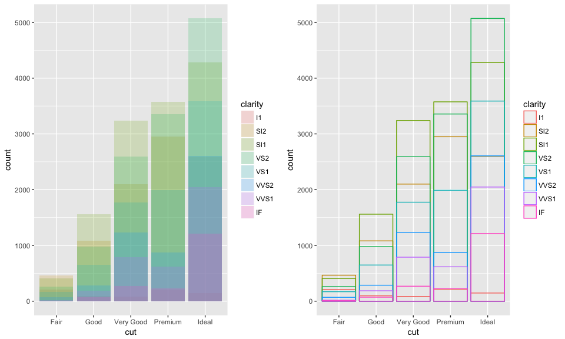<!-- -->
  
##Compare position="fill" and position="dodge"

```r
al1 <- ggplot(data=diamonds) +
  geom_bar(mapping = aes(x=cut,fill=clarity),position = "fill")
al2 <- ggplot(data=diamonds) + 
  geom_bar(mapping = aes(x=cut,fill=clarity),position = "dodge")
grid.arrange(al1,al2,nrow=1,ncol=2)
```

<!-- -->
  
##How to deal with overplotting in scatterplot by position="jitter"

```r
bl1 <- ggplot(data = mpg) + 
  geom_point(mapping = aes(x = displ, y = hwy))
bl2 <- ggplot(data = mpg) + 
  geom_point(mapping = aes(x = displ, y = hwy), position = "jitter")
grid.arrange(bl1,bl2,nrow=1,ncol=2)
```

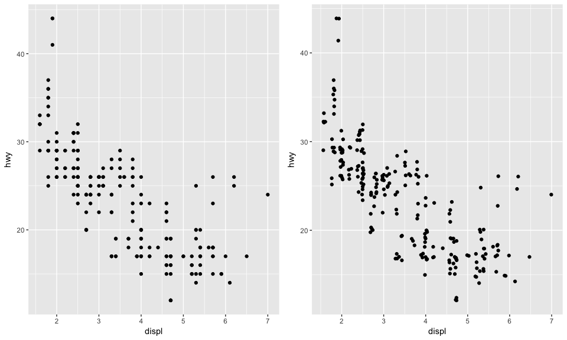<!-- -->
  
#3.9 Coordinate systems
##coord_flip() switches the x and y axes

```r
cl1 <- ggplot(data = mpg, mapping = aes(x = class, y = hwy)) + 
  geom_boxplot(mapping = aes(fill=class),alpha=3/5)
cl2 <- ggplot(data = mpg, mapping = aes(x = class, y = hwy)) + 
  geom_boxplot() +
  coord_flip()
grid.arrange(cl1,cl2,nrow=1,ncol=2)
```

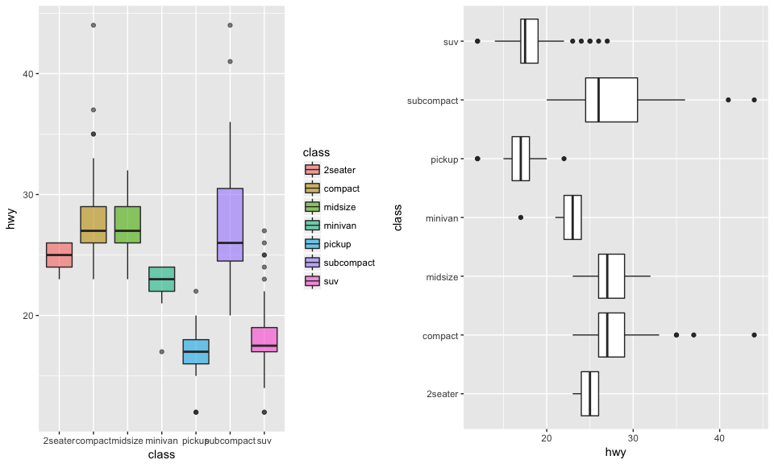<!-- -->
  
##coord_polar() uses polar coordinates

```r
bar <- ggplot(data = diamonds) + 
  geom_bar(
    mapping = aes(x = cut, fill = cut), 
    show.legend = FALSE,
    width = 1
  ) + 
  theme(aspect.ratio = 1) +
  labs(x = NULL, y = NULL)

bar1 <- bar + coord_flip()
bar2 <- bar + coord_polar()

grid.arrange(bar1,bar2,nrow=1,ncol=2)
```

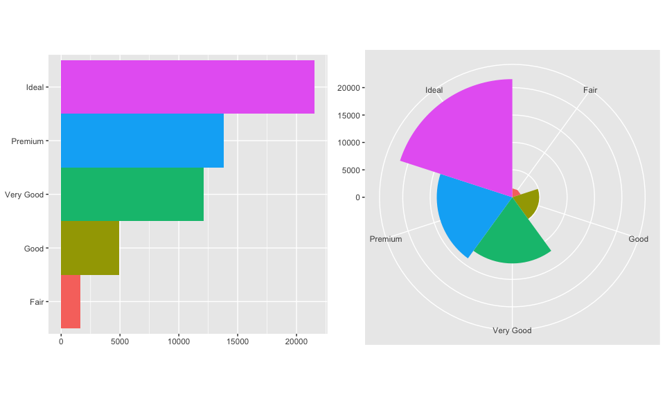<!-- -->
  
##Let’s add position adjustments, stats, coordinate systems, and faceting to our code template, type it by myself

ggplot(data=<DATA>)+
  <GEOM_FUNCTION>(
    mapping=aes(x=<VARIABLE1>,y=<PREDICTIONS>,fill=<VARIABLE2>,color=<VARIABLE3>),#basic athetics for ggplot
    stat="<STAT>",#statistical transformation in ggplot, for example we can calculate the error bar, including ymin and ymax, for y in each x, by stat_summary
    position="<POSITION>" #position adjustment, which could deal with the overlapping in ggplot
  ) + 
  <COORDINATE_FUNCTION> + #change the direction or dimention for the plot, for example, to change the position for x and y
  <FACET_FUNCTION>#split the plot by catagorical variables, including facet_warp and facet_gird


#Exercises
##3.6.1
###1. What geom would you use to draw a line chart? A boxplot? A histogram? An area chart?  
####geom_smooth()
###2. Run this code in your head and predict what the output will look like. Then, run the code in R and check your predictions.

```r
ggplot(data = mpg, mapping = aes(x = displ, y = hwy, color = drv)) + 
  geom_point() + 
  geom_smooth(se = FALSE)
```

```
## `geom_smooth()` using method = 'loess'
```

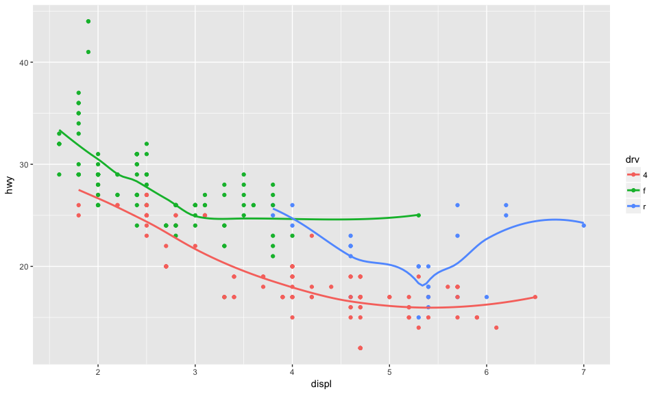<!-- -->
  
##3. What does show.legend = FALSE do? What happens if you remove it?

```r
#logical. Should this layer be included in the legends? NA, the default, includes if any aesthetics are mapped. FALSE never includes, and TRUE always includes.
Q1 <- ggplot(data = mpg, mapping = aes(x = displ, y = hwy)) + 
  geom_point(mapping = aes(color=class),show.legend = FALSE) + 
  geom_smooth()
Q2 <- ggplot(data = mpg, mapping = aes(x = displ, y = hwy)) + 
  geom_point(mapping = aes(color=class)) + 
  geom_smooth()
grid.arrange(Q1,Q2,nrow=1,ncol=2)
```

```
## `geom_smooth()` using method = 'loess'
## `geom_smooth()` using method = 'loess'
```

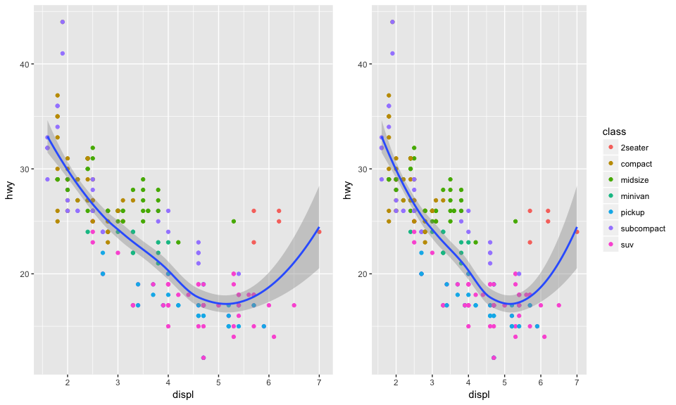<!-- -->

  
##4. Why do you think I used it earlier in the chapter?  

##5. What does the se argument to geom_smooth() do?

```r
?geom_smooth
#se: display confidence interval around smooth? (TRUE by default, see level to control)
```

##6. Will these two graphs look different? Why/why not?

```r
p1 <- ggplot(data = mpg, mapping = aes(x = displ, y = hwy)) + 
  geom_point() + 
  geom_smooth()

p2 <- ggplot() + 
  geom_point(data = mpg, mapping = aes(x = displ, y = hwy)) + 
  geom_smooth(data = mpg, mapping = aes(x = displ, y = hwy))  

grid.arrange(p1,p2,nrow=1,ncol=2)
```

```
## `geom_smooth()` using method = 'loess'
## `geom_smooth()` using method = 'loess'
```

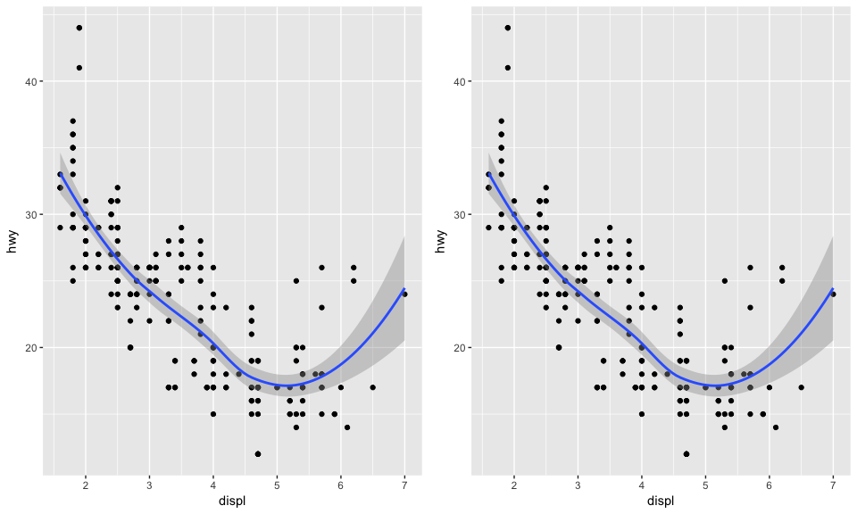<!-- -->
  
##7. Recreate the R code necessary to generate the following graphs.

```r
pll1 <- ggplot(data = mpg, mapping = aes(x = displ, y = hwy)) + 
  geom_point() + 
  geom_smooth(se=FALSE)
pll2 <- ggplot(data = mpg, mapping = aes(x = displ, y = hwy)) + 
  geom_smooth(mapping = aes(group=drv),se=FALSE) + 
  geom_point() 
pll3 <- ggplot(data = mpg, mapping = aes(x = displ, y = hwy,color=drv)) + 
  geom_smooth(mapping = aes(group=drv),se=FALSE) + 
  geom_point() 
pll4 <- ggplot(data = mpg, mapping = aes(x = displ, y = hwy)) + 
  geom_point(mapping=aes(color=drv)) + 
  geom_smooth(se=FALSE) 
pll5 <- ggplot(data = mpg, mapping = aes(x = displ, y = hwy)) + 
  geom_point(mapping=aes(color=drv)) + 
  geom_smooth(mapping=aes(linetype=drv),se=FALSE)
pll6 <- ggplot(data = mpg, mapping = aes(x = displ, y = hwy, fill=drv)) + 
  geom_point(shape=21,color="white") #the point is letting shape and color go outside of aes()

grid.arrange(pll1,pll2,pll3,pll4,pll5,pll6,nrow=3,ncol=2)
```

```
## `geom_smooth()` using method = 'loess'
## `geom_smooth()` using method = 'loess'
## `geom_smooth()` using method = 'loess'
## `geom_smooth()` using method = 'loess'
## `geom_smooth()` using method = 'loess'
```

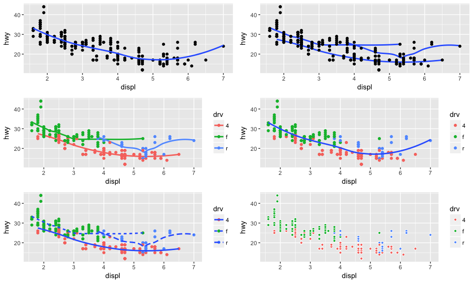<!-- -->
  
#3.7.1 Exercises 
##1. What is the default geom associated with stat_summary()? How could you rewrite the previous plot to use that geom function instead of the stat function?

```r
ggplot(data = diamonds) + 
  stat_summary(
    mapping = aes(x = cut, y = depth),
    fun.ymin = min,
    fun.ymax = max,
    fun.y = median
  )
summary(diamonds)
ggplot(data = diamonds) +
  geom_pointrange(mapping = aes(x=cut,y=depth),stat = "identity")

?geom_pointrange
```


##2. What does geom_col() do? How is it different to geom_bar()?

```r
aa1 <- ggplot(data=diamonds) +
  geom_col(mapping = aes(x=cut,y=depth))

aa2 <- ggplot(data=diamonds) +
  geom_bar(mapping = aes(x=cut))

grid.arrange(aa1,aa2,nrow=1,ncol=2)
```

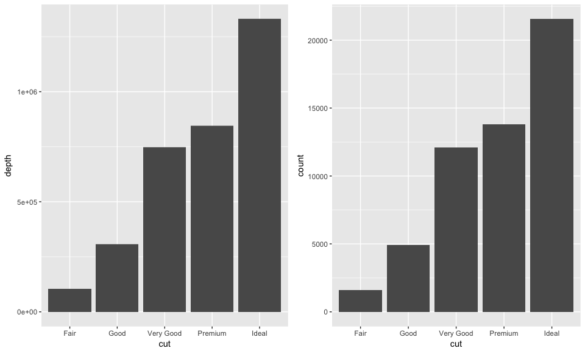<!-- -->

```r
?geom_boxplot
#geom_bar uses stat_count by default: it counts the number of cases at each x position. geom_col uses stat_identity: it leaves the data as is.
```

##3. Most geoms and stats come in pairs that are almost always used in concert. Read through the documentation and make a list of all the pairs. What do they have in common?
  
###a) geom_bar/geom_col/stat_count 
###b) geom_freqpoly/geom_histogram/stat_bin 
###c) geom_boxplot/stat_boxplot 
###d) geom_smooth/stat_smooth

##3. What variables does stat_smooth() compute? What parameters control its behaviour?

```r
?stat_smooth
#It use predict to compute the standard errors
#'se' is applied to control its behaviour 
```

##4. In our proportion bar chart, we need to set group = 1. Why? In other words what is the problem with these two graphs?

```r
a11 <- ggplot(data = diamonds) + 
  geom_bar(mapping = aes(x = cut, y = ..prop..))
a22 <- ggplot(data = diamonds) + 
  geom_bar(mapping = aes(x = cut, fill = color, y = ..prop..), show.legend = FALSE)
a33 <- ggplot(data = diamonds) + 
  geom_bar(mapping = aes(x = cut, y = ..prop..,group=1))

grid.arrange(a11,a22,a33,nrow=1,ncol=3)
```

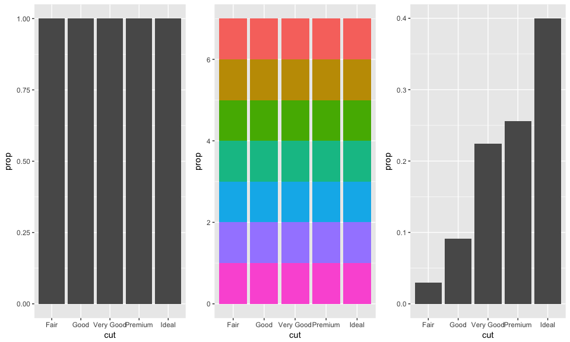<!-- -->
 
# 3.8.1 Exercise 
##1. What is the problem with this plot? How could you improve it?

```r
b11 <- ggplot(data = mpg, mapping = aes(x = cty, y = hwy)) + 
  geom_point()
b22 <- ggplot(data = mpg, mapping = aes(x = cty, y = hwy)) + 
  geom_point(position = "jitter")
grid.arrange(b11,b22,nrow=1,ncol=2)
```

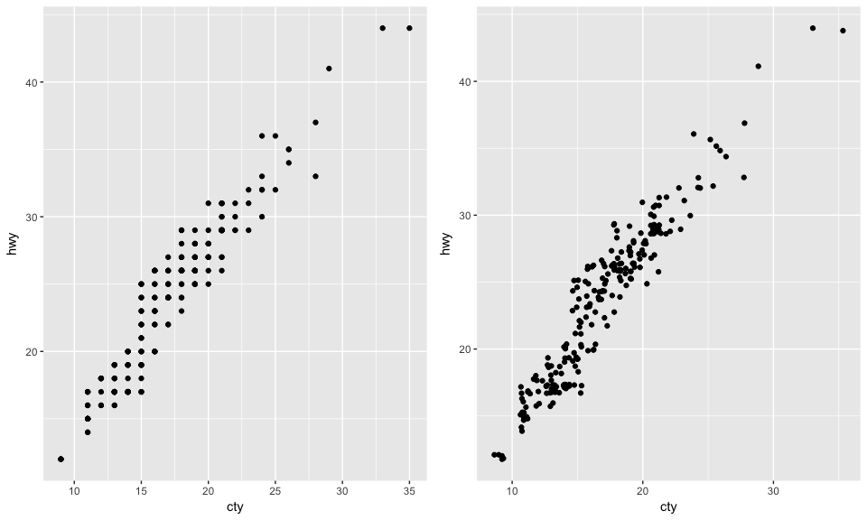<!-- -->

```r
#The problem is many points overlapping each other, which is known as 'overplotting'; I can avoid this gridding by setting the position adjustment to “jitter”.
```
 
##2. What parameters to geom_jitter() control the amount of jittering?

```r
#width and height
b22 <- ggplot(data = mpg, mapping = aes(x = cty, y = hwy)) + 
  geom_jitter()
b23 <- ggplot(data = mpg, mapping = aes(x = cty, y = hwy)) + 
  geom_jitter(width = 2,height = 2)

grid.arrange(b22,b23,nrow=1,ncol=2)
```

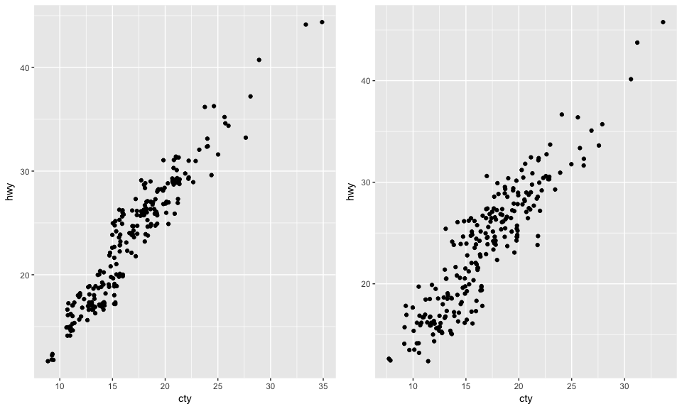<!-- -->

##3. Compare and contrast geom_jitter() with geom_count().

```r
a23 <- ggplot(data = mpg, mapping = aes(x = cty, y = hwy)) + 
  geom_jitter(width = 2,height = 2)
a24 <- ggplot(data = mpg, mapping = aes(x = cty, y = hwy)) + 
  geom_count(show.legend = FALSE)

grid.arrange(a23,a24,nrow=1,ncol=2)
```

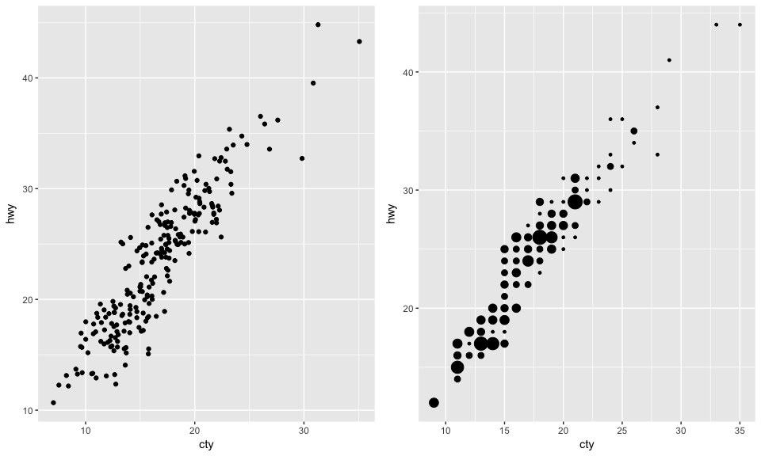<!-- -->


##4. What’s the default position adjustment for geom_boxplot()? Create a visualisation of the mpg dataset that demonstrates it.

```r
ggplot(data = mpg, mapping = aes(x = cty, y = hwy,color=class)) + 
  geom_boxplot()
```

```
## Warning: position_dodge requires non-overlapping x intervals
```

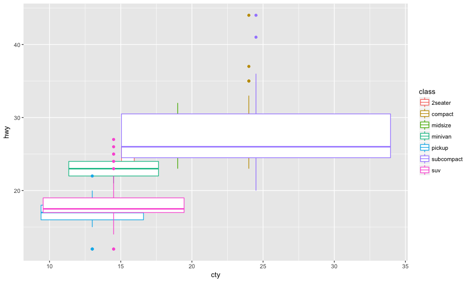<!-- -->

```r
#it relys on the value of x-axies
```

 
# 3.9.1 Exercises
##1. Turn a stacked bar chart into a pie chart using coord_polar().

```r
a39_1 <- ggplot(data = diamonds) + geom_bar(mapping = aes(x = cut, fill = clarity))

a39_2 <- ggplot(data = diamonds) + geom_bar(mapping = aes(x = cut, fill = clarity)) + coord_polar()

grid.arrange(a39_1,a39_2,nrow=1,ncol=2)
```

<!-- -->
##2. What does labs() do? Read the documentation.

```r
?labs
#Modify axis, legend, and plot labels
```

##3. What’s the difference between coord_quickmap() and coord_map()?

```r
nz <- map_data("nz")
```

```
## 
## Attaching package: 'maps'
```

```
## The following object is masked from 'package:purrr':
## 
##     map
```

```r
a <- ggplot(nz, aes(long, lat, group = group)) +
  geom_polygon(fill = "white", colour = "black") +
  coord_quickmap()

b <- ggplot(nz, aes(long, lat, group = group)) +
  geom_polygon(fill = "white", colour = "black") +
  coord_map()

grid.arrange(a,b,nrow=1,ncol=2)
```

<!-- -->

```r
#?coord_quikemap: coord_map projects a portion of the earth, which is approximately spherical, onto a flat 2D plane using any projection defined by the mapproj package. Map projections do not, in general, preserve straight lines, so this requires considerable computation. coord_quickmap is a quick approximation that does preserve straight lines. It works best for smaller areas closer to the equator.
```

##4. What does the plot below tell you about the relationship between city and highway mpg? Why is coord_fixed() important? What does geom_abline() do? 

```r
ggplot(data = mpg, mapping = aes(x = cty, y = hwy)) +#positive correlation
  geom_point() + 
  geom_abline() +#plot the straight line
  coord_fixed()#it make the size of x-axis and y-axis fixed, and the positive relationships are more obviously
```

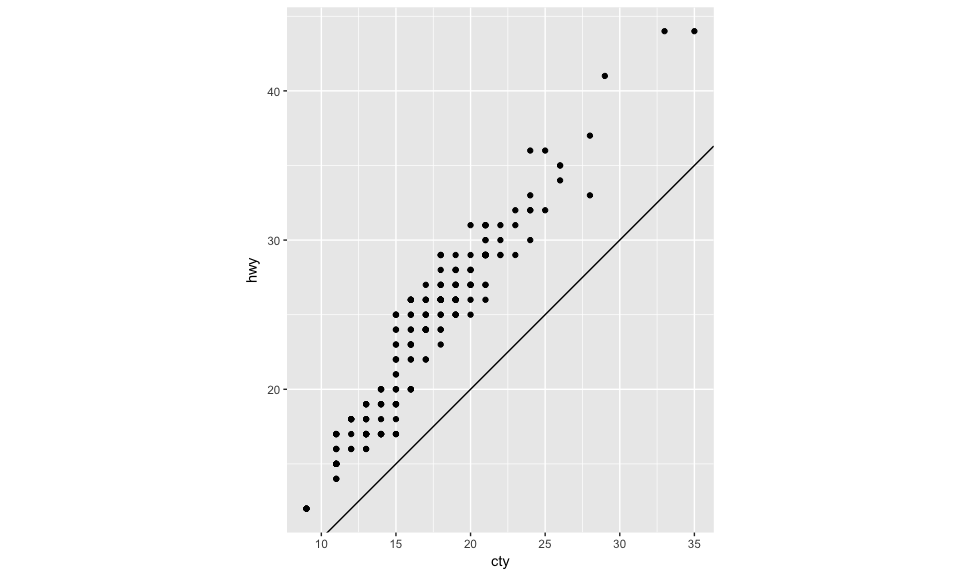<!-- -->

